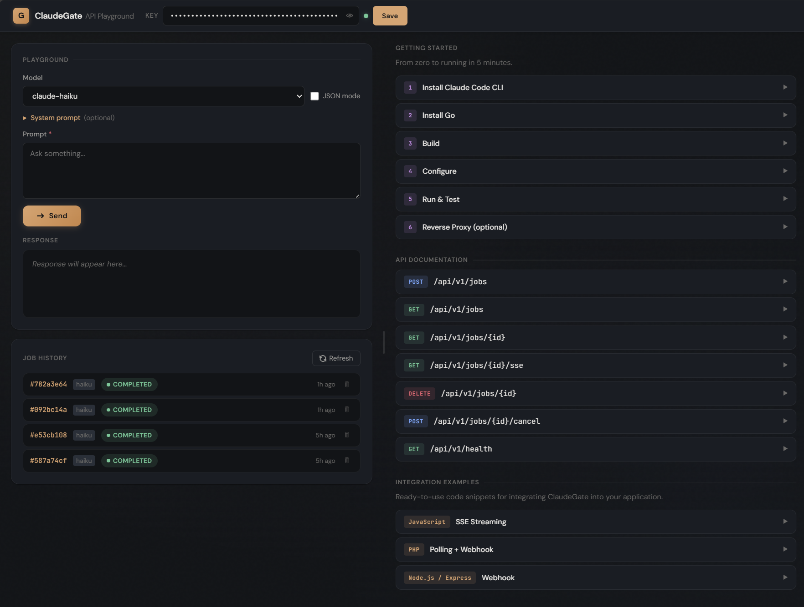

# ClaudeGate

HTTP gateway that wraps Claude Code CLI as a REST API with an async job queue.



## Features

- Async job queue with configurable concurrency
- Three result delivery modes: polling, SSE (Server-Sent Events), and webhook callback
- Job cancellation (cancel queued or processing jobs via API)
- Per-job timeout with configurable duration
- CORS support with configurable allowed origins
- Automatic cleanup of old terminal jobs (TTL-based)
- Built-in web playground with job history and API documentation (served at `/`)
- JSON response mode (`response_format: "json"`) with automatic code fence stripping
- Multi-model support: haiku, sonnet, opus
- SQLite-backed job persistence with crash recovery
- API key authentication with constant-time comparison
- SSRF protection on webhook callback URLs
- Optional system prompt and metadata per job
- Single static binary (pure Go, no CGO) with embedded frontend

## Prerequisites

Before you start, make sure you have:

- A Linux server (Debian/Ubuntu recommended)
- An Anthropic account with Claude Code CLI access
- Basic terminal knowledge
- Node.js 18+ installed (`node --version` to check)

## Installation

### Step 1: Install Claude Code CLI

```bash
# Install Claude Code globally
npm install -g @anthropic-ai/claude-code

# Authenticate — follow the prompts to log in with your Anthropic account
claude
```

> Note the path to the `claude` binary — you will need it in Step 4.
> ```bash
> which claude
> # Example output: /usr/local/bin/claude
> ```

### Step 2: Install Go (via mise)

```bash
# Install mise (polyglot tool version manager)
curl https://mise.run | sh

# Add mise to your shell
echo 'eval "$(~/.local/bin/mise activate bash)"' >> ~/.bashrc
source ~/.bashrc

# Install the latest Go toolchain
mise use -g go@latest
```

### Step 3: Clone and build ClaudeGate

```bash
git clone https://github.com/ohugonnot/claudegate.git
cd claudegate

# Compile the static binary to bin/claudegate
make build
```

### Step 4: Configure

```bash
cp .env.example .env
```

Then edit `.env` with your values:

```bash
# Required: one or more comma-separated API keys for authenticating requests
# Generate a strong key with: openssl rand -base64 36
CLAUDEGATE_API_KEYS=<your-generated-key>

# Required: absolute path to the Claude CLI binary (from `which claude`)
CLAUDEGATE_CLAUDE_PATH=/usr/local/bin/claude

# Optional: bind to localhost only (recommended for production with a reverse proxy)
CLAUDEGATE_LISTEN_ADDR=127.0.0.1:8080

# Optional: default model when none is specified in a job request
CLAUDEGATE_DEFAULT_MODEL=haiku

# Optional: number of parallel Claude CLI workers
CLAUDEGATE_CONCURRENCY=1

# Optional: SQLite database file path (for job persistence)
CLAUDEGATE_DB_PATH=claudegate.db

# Optional: in-memory queue capacity
CLAUDEGATE_QUEUE_SIZE=1000

# Optional: per-job execution timeout in minutes (0 = no timeout)
CLAUDEGATE_JOB_TIMEOUT_MINUTES=0

# Optional: comma-separated CORS origins (* = allow all, empty = disabled)
CLAUDEGATE_CORS_ORIGINS=

# Optional: auto-delete terminal jobs older than N hours (0 = disabled)
CLAUDEGATE_JOB_TTL_HOURS=0

# Optional: cleanup interval in minutes (only applies when TTL > 0)
CLAUDEGATE_CLEANUP_INTERVAL_MINUTES=60
```

> **All variables are read from the environment — ClaudeGate has no built-in `.env` loader.**
> The `.env` file is picked up by systemd via `EnvironmentFile` (see the Systemd section), or you can `export` them manually before running.

### Step 5: Run

```bash
# Run directly (for testing)
./bin/claudegate

# Or use make
make run
```

> For production, run ClaudeGate as a systemd service. See the **Systemd** section below.

### Step 6: Test it

```bash
# Health check — no authentication required
curl http://localhost:8080/api/v1/health

# Submit a job
curl -X POST http://localhost:8080/api/v1/jobs \
  -H "X-API-Key: YOUR_KEY" \
  -H "Content-Type: application/json" \
  -d '{"prompt": "Say hello!", "model": "haiku"}'

# Open the web playground in your browser
# http://localhost:8080/
```

## Security Note

ClaudeGate runs Claude CLI with `--dangerously-skip-permissions`, which means Claude can execute any action the system user has permissions for. **Never run it as root.**

```bash
# Create a dedicated system user with no login shell
sudo useradd -r -s /usr/sbin/nologin claudegate

# Run the service as this user (see the Systemd section)
```

> The default security system prompt instructs Claude to refuse filesystem, shell, and network operations. This is a soft guardrail — see the **Security** section for full details.

## API Reference

All endpoints (except `/` and `/api/v1/health`) require the `X-API-Key` header.

### POST /api/v1/jobs

Submit a new job. Returns `202 Accepted` with the created job object.

**Request body:**

| Parameter | Required | Description |
|---|---|---|
| `prompt` | **yes** | The text prompt to send to Claude |
| `model` | no | `haiku` (default), `sonnet`, or `opus` |
| `system_prompt` | no | Custom system instruction prepended to the prompt |
| `callback_url` | no | Webhook URL — ClaudeGate POSTs the result here when the job finishes |
| `response_format` | no | `text` (default) or `json` — JSON mode strips markdown fences from the response |
| `metadata` | no | Arbitrary JSON object, returned as-is in the job response |

```bash
curl -X POST http://localhost:8080/api/v1/jobs \
  -H "X-API-Key: your-secret-key-here" \
  -H "Content-Type: application/json" \
  -d '{
    "prompt": "Explain what a mutex is in one sentence.",
    "model": "haiku",
    "system_prompt": "Be concise.",
    "response_format": "json",
    "callback_url": "https://example.com/webhook",
    "metadata": {"user_id": 42}
  }'
```

Response:
```json
{
  "job_id": "a1b2c3d4-...",
  "prompt": "Explain what a mutex is in one sentence.",
  "model": "haiku",
  "status": "queued",
  "created_at": "2025-06-15T00:00:00Z"
}
```

### GET /api/v1/jobs/{id}

Poll a job's status and result.

**Path parameters:**

| Parameter | Description |
|---|---|
| `id` | Job UUID returned by the POST endpoint |

```bash
curl http://localhost:8080/api/v1/jobs/a1b2c3d4-... \
  -H "X-API-Key: your-secret-key-here"
```

Response:
```json
{
  "job_id": "a1b2c3d4-...",
  "prompt": "Explain what a mutex is in one sentence.",
  "model": "haiku",
  "status": "completed",
  "result": "A mutex is a synchronization primitive that ensures only one goroutine accesses a shared resource at a time.",
  "created_at": "2025-06-15T00:00:00Z",
  "started_at": "2025-06-15T00:00:00.1Z",
  "completed_at": "2025-06-15T00:00:02Z"
}
```

Job statuses: `queued`, `processing`, `completed`, `failed`, `cancelled`.

### GET /api/v1/jobs

List jobs with pagination. Returns `200 OK`.

**Query parameters:**

| Parameter | Default | Description |
|---|---|---|
| `limit` | `20` | Number of jobs to return (max 100) |
| `offset` | `0` | Number of jobs to skip |

```bash
curl "http://localhost:8080/api/v1/jobs?limit=10&offset=0" \
  -H "X-API-Key: your-secret-key-here"
```

Response:
```json
{
  "jobs": [{"job_id": "...", "status": "completed", ...}],
  "total": 42,
  "limit": 10,
  "offset": 0
}
```

### GET /api/v1/jobs/{id}/sse

Stream job progress via Server-Sent Events. The connection closes automatically when the job finishes.

**Path parameters:**

| Parameter | Description |
|---|---|
| `id` | Job UUID to stream |

```bash
curl -N http://localhost:8080/api/v1/jobs/a1b2c3d4-.../sse \
  -H "X-API-Key: your-secret-key-here"
```

Events emitted:
- `status` — job moved to `processing`
- `chunk` — incremental text from the model (payload: `{"text": "..."}`)
- `result` — final status, result, and error (connection closes after this)

### DELETE /api/v1/jobs/{id}

Delete a job record. Returns `204 No Content`.

**Path parameters:**

| Parameter | Description |
|---|---|
| `id` | Job UUID to delete |

```bash
curl -X DELETE http://localhost:8080/api/v1/jobs/a1b2c3d4-... \
  -H "X-API-Key: your-secret-key-here"
```

### POST /api/v1/jobs/{id}/cancel

Cancel a queued or processing job. Returns `200 OK` with the cancelled status, or `409 Conflict` if the job is already in a terminal state.

**Path parameters:**

| Parameter | Description |
|---|---|
| `id` | Job UUID to cancel |

```bash
curl -X POST http://localhost:8080/api/v1/jobs/a1b2c3d4-.../cancel \
  -H "X-API-Key: your-secret-key-here"
```

Response (success):
```json
{"status": "cancelled"}
```

Response (already terminal):
```json
{"error": "job already in terminal state"}
```

### GET /api/v1/health

Health check. No authentication required.

```bash
curl http://localhost:8080/api/v1/health
```

Response:
```json
{"status": "ok"}
```

## Docker

The image bundles Claude Code CLI. You only need to mount your host credentials — no extra installation inside the container.

**1. Build the image**

```bash
docker build -t claudegate .
```

**2. Authenticate Claude on the host** (one-time setup)

```bash
npm install -g @anthropic-ai/claude-code
claude  # follow the prompts to log in
```

This writes auth tokens to `~/.claude/` on the host, which you mount read-only into the container.

**3. Run**

```bash
docker run -d \
  --name claudegate \
  -p 8080:8080 \
  -v ~/.claude:/claude-credentials:ro \
  -v claudegate-data:/app/data \
  -e CLAUDEGATE_API_KEYS=your-secret-key \
  claudegate
```

| Flag | Purpose |
|---|---|
| `-v ~/.claude:/claude-credentials:ro` | Mount host Claude auth tokens (read-only) |
| `-v claudegate-data:/app/data` | Persist the SQLite job database |
| `-e CLAUDEGATE_API_KEYS` | Required: API key(s) for authentication |

**4. Security note**

The container isolates Claude CLI from the host. Even if the API is compromised, the attacker is confined to the container with no access to the host filesystem or network beyond what Docker allows. The credentials are mounted read-only at `/claude-credentials` and copied at startup to a writable `~/.claude/` directory inside the container, so Claude CLI can create temporary files (session state, debug logs, plugin directories) without being able to modify your original auth tokens.

## Systemd

The included `claudegate.service` assumes the binary lives at `/opt/claudegate/`. Adjust `ExecStart`, `WorkingDirectory`, and `EnvironmentFile` paths if your setup differs.

```bash
# Build and copy the binary
make build
cp bin/claudegate /opt/claudegate/bin/claudegate

# Copy and configure the environment file
cp .env.example /opt/claudegate/.env
# Edit /opt/claudegate/.env with your values

# Install and start the service
cp claudegate.service /etc/systemd/system/claudegate.service
systemctl daemon-reload
systemctl enable --now claudegate

# Follow live logs
journalctl -u claudegate -f
```

## Security

### How it works

ClaudeGate uses `--dangerously-skip-permissions` to run Claude CLI without interactive confirmation prompts. This is required for API/daemon usage but means Claude can execute any action the system user has permissions for.

### Built-in protections

- **Security system prompt (default ON):** A server-side system prompt is prepended to every job, instructing Claude to only provide text responses and refuse filesystem, shell, or network operations. This is a soft guardrail — it relies on Claude following instructions, not a technical sandbox.
- **API key authentication:** All endpoints (except health) require a valid `X-API-Key` header. Keys are compared using constant-time comparison to prevent timing attacks.
- **Dedicated system user:** The service should run as a non-root user with minimal permissions. Never run as root.
- **Localhost binding:** By default, configure `CLAUDEGATE_LISTEN_ADDR=127.0.0.1:8080` and use a reverse proxy for external access.

### Disabling the security prompt

Set `CLAUDEGATE_UNSAFE_NO_SECURITY_PROMPT=true` to remove the security system prompt. This gives Claude full access to the system (within the service user's permissions). Only do this if:
- You fully trust all API key holders
- The service user has minimal filesystem access
- You have network-level access controls in place

### Recommendations for production

- Use strong, randomly generated API keys (32+ characters)
- Rotate API keys regularly
- Run behind a reverse proxy with TLS
- Monitor logs for suspicious prompts
- Consider network-level restrictions (firewall, VPN)
- Run the service user with the most restrictive permissions possible

## Reverse Proxy (Production)

In production, bind ClaudeGate to localhost and use a reverse proxy for external access with TLS.

```bash
CLAUDEGATE_LISTEN_ADDR=127.0.0.1:8080
```

> **Important:** SSE streaming requires the proxy to flush packets immediately. Without this, SSE connections will hang until the job finishes.

### Apache

```apache
# Enable required modules: a]proxy proxy_http headers
# sudo a2enmod proxy proxy_http headers

# In your VirtualHost block:
ProxyPreserveHost On

# ClaudeGate — flushpackets=on is critical for SSE streaming
ProxyPass        /claudegate/ http://127.0.0.1:8080/ flushpackets=on
ProxyPassReverse /claudegate/ http://127.0.0.1:8080/
```

### Nginx

```nginx
location /claudegate/ {
    proxy_pass http://127.0.0.1:8080/;
    proxy_set_header Host $host;
    proxy_set_header X-Real-IP $remote_addr;
    proxy_set_header X-Forwarded-For $proxy_add_x_forwarded_for;
    proxy_set_header X-Forwarded-Proto $scheme;

    # SSE streaming — disable buffering
    proxy_buffering off;
    proxy_cache off;
    proxy_read_timeout 300s;
}
```

### Caddy

```
example.com {
    handle_path /claudegate/* {
        reverse_proxy localhost:8080
    }
}
```
Caddy handles SSE streaming and TLS certificates automatically.

## Architecture

### Overview

```
                                    ┌─────────────┐
POST /api/v1/jobs ──► API Handler ──► SQLite Store │
                                    └──────┬──────┘
                                           │
                                    ┌──────▼──────┐
                                    │  Queue (chan)│
                                    └──────┬──────┘
                                           │
                                    ┌──────▼──────┐
                                    │   Worker    │
                                    │ (claude CLI)│
                                    └──┬───────┬──┘
                                       │       │
                              ┌────────▼┐  ┌───▼────────┐
                              │  SQLite  │  │  SSE stream │
                              │ (result) │  │  (chunks)   │
                              └────────┬┘  └────────────┘
                                       │
                              ┌────────▼────────┐
                              │ Webhook callback │
                              │   (optional)     │
                              └─────────────────┘
```

A job is created in SQLite and enqueued in memory. Workers pick it up, call the Claude CLI, stream chunks back via SSE, and write the final result to SQLite. Webhooks fire-and-forget after completion.

### Project Structure

```
claudegate/
├── cmd/claudegate/
│   └── main.go              # Entry point: wiring, startup, graceful shutdown
├── internal/
│   ├── api/
│   │   ├── handler.go       # HTTP handlers for all REST endpoints
│   │   ├── middleware.go    # Auth, request ID, logging middleware
│   │   └── sse.go           # Server-Sent Events streaming handler
│   ├── config/
│   │   └── config.go        # Configuration loaded from environment variables
│   ├── job/
│   │   ├── model.go         # Job struct, Status type, CreateRequest + validation
│   │   ├── store.go         # Store interface (abstracts the storage backend)
│   │   └── sqlite.go        # SQLite implementation of Store
│   ├── queue/
│   │   └── queue.go         # Buffered channel queue, worker pool, SSE fan-out
│   ├── webhook/
│   │   └── webhook.go       # Async webhook delivery with exponential backoff
│   └── worker/
│       └── worker.go        # Claude CLI execution and stream-json parsing
├── testdata/
│   └── mock-claude.sh       # Shell mock of Claude CLI for tests
├── Dockerfile               # Multi-stage build producing a static binary
├── Makefile                 # Build, test, lint, run targets
└── claudegate.service       # systemd unit file for daemon mode
```

### Design Decisions

| Decision | Rationale |
|---|---|
| **No HTTP framework** | Go stdlib routing (1.22+) covers method matching and path parameters. No dependency, no magic. |
| **SQLite over Postgres/Redis** | Zero config, embedded in the binary's working directory, one file to back up. The bottleneck is the Claude CLI (seconds/job), not DB throughput. |
| **Buffered channel over a message broker** | Same reasoning: the channel is orders of magnitude faster than any external queue. Simplicity wins. |
| **`modernc.org/sqlite` (pure Go)** | `CGO_ENABLED=0` enables cross-compilation and scratch/Alpine containers without a C toolchain. |
| **API key auth over OAuth/JWT** | This is a machine-to-machine API. API keys are simpler to issue, rotate, and validate. No token expiry, no refresh flow. |
| **`stream-json` parsing** | Native output format of the Claude CLI. Parsing it directly avoids wrapping the CLI in a PTY or scraping human-readable output. |
| **Job ID only in channel** | Enqueueing the ID rather than the full `Job` struct keeps the channel payload tiny and ensures workers always read the latest state from the DB. |
| **Constant-time key comparison** | Timing attacks on string equality are a real class of vulnerability for authentication secrets. `subtle.ConstantTimeCompare` costs nothing and closes the vector. |

## License

MIT — see [LICENSE](LICENSE).
